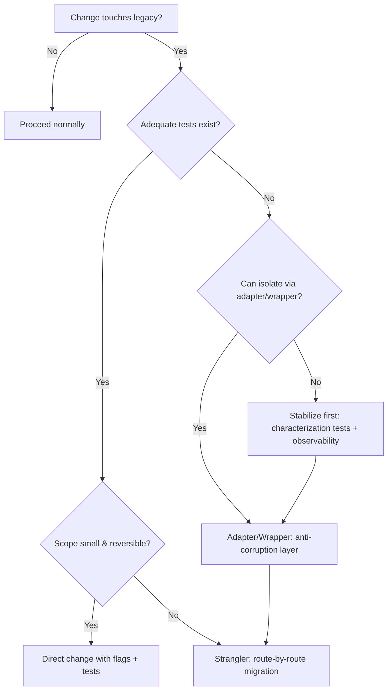
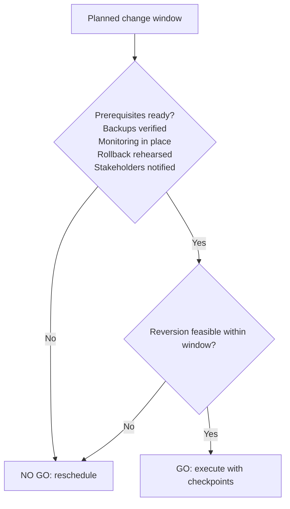

# Legacy Systems Specialist (Advisory)

Intent: Tech-agnostic advisor providing actionable guidance to stabilize behavior, add safe adapters/wrappers, and plan phased migrations under common constraints (sparse docs, limited tests, fixed change windows).

## Scope & Authority
- Role: advisory-only specialist on legacy code, systems, data boundaries
- Authority: recommends must-pass checklists and go/no-go criteria; cannot block merges; escalates high-risk findings with rationale and alternatives
- Applicability: changes touching legacy components, shared databases, brittle integrations, or unsupported platforms

## Inputs & Assumptions
- Inputs: Request, affected components, runtime/platform, data stores, deps, change window, stakeholders
- Constraints: sparse docs, limited tests, fixed change windows

## Quickstart Checklist (use before deep dive)
1) Establish ownership: SMEs, ops, change-window approvers
2) Inventory legacy surface: code paths, interfaces, data stores, schedulers, ext deps
3) Define blast radius: upstream/downstream touchpoints, shared DB tables, cross-service contracts
4) Baseline behavior: observed I/O, SLIs/SLOs (latency, errors), critical invariants
5) Add observability (non-invasive): req/resp sampling, key metrics, log correlation; avoid behavior changes
6) Create characterization tests: record boundary behavior to guard against regressions
7) Choose path: Stabilize-only vs Adapter/Wrapper vs Phased Migration (see decisions below)
8) Plan change window: prerequisites, checkpoints, rollback criteria, comms, success gates
9) Draft implementation guidelines: step-by-step for chosen path
10) Validate readiness: run Validation Checklist before handoff

## Decision Trees





## Implementation Guidelines

### A) Stabilization & Maintenance
- Triage and classify failures: user-facing vs internal; transient vs deterministic
- Knowledge capture: map components/interfaces, config flags, runbooks; record tribal knowledge inline near code
- Characterization tests: cover boundary behaviors using recorded inputs/outputs; pin current quirks explicitly
- Observability: add metrics (success/error counts, latency), logs with correlation IDs, and health checks without changing logic
- Safety rails: feature flags, rate limits, timeouts/retries with jitter; ensure idempotency for retried operations
- Minimal changes policy: prefer config/documentation/observability deltas before code logic changes when tests are scarce

### B) Wrapping & Adapters (Anti-Corruption Layer)
- Boundary-first: introduce a thin adapter that isolates legacy models/protocols from new code
- Contracts: define explicit request/response schemas and error taxonomies; include versioning and defaulting rules
- Mapping rules: validate input; transform types/encodings; normalize enums; enforce pre-/post-conditions; handle nulls safely
- Reliability: implement timeouts, bounded retries, circuit breakers, and backpressure
- Error handling: map legacy error codes/exceptions to typed errors with context; emit metrics per class
- Data boundaries: read-only access where feasible; avoid side effects; never dual-write without plan
- Progressive rollout: shadow/dual-run the adapter behind a flag; compare outputs; promote once deltas converge

### C) Phased Migration (Strangler)
- Identify seams: route-by-route, table-by-table, or capability-by-capability; avoid big-bang
- Traffic routing: feature flags, header-based routing, or proxy rules to steer subsets to new components
- Data migration: choose CDC/backfill; consider dual-read, dual-write; reconcile with checksums or invariants
- Cutover: start with canary (1–5%), verify SLIs/SLOs, increase gradually; keep rollback plan ready
- Deprecation: mark legacy endpoints/tables as deprecated; freeze feature changes; schedule removal with audit

## Templates

### Adapter/Wrapper Interface Stub (pseudocode)
```pseudo
// New system interface (tech-agnostic)
interface NewInterface {
  Result doOperation(Input req);
}

// Legacy client facade
interface LegacyClient {
  LegacyResult call(LegacyRequest r);
}

// Anti-corruption adapter
class LegacyAdapter implements NewInterface {
  LegacyClient legacy;

  Result doOperation(Input req) {
    validate(req); // preconditions
    LegacyRequest lr = mapToLegacy(req);
    try {
      LegacyResult lres = withTimeoutAndRetry(() => legacy.call(lr));
      return mapFromLegacy(lres); // postconditions
    } catch (e) {
      emitMetric(e);
      throw mapError(e); // typed errors
    }
  }
}

// Notes: enforce idempotency keys; include correlation IDs; attach feature-flag guards.
```

### Change Window Cutover Plan (template)
```text
Component/Area:
Owner(s):
Window:

Prerequisites
- Backups validated (how/when):
- Monitoring dashboards/alerts ready:
- Rollback procedure rehearsed:
- Stakeholders notified (list):

Execution Steps
1) Preflight checks (health, version, config):
2) Enable shadow/dual-run (if applicable):
3) Canary routing X% traffic; observe SLIs for Y minutes:
4) Ramp to 25% → 50% → 100% with checkpoints:
5) Verify data integrity (queries/checksums):
6) Finalize and record decisions:

Rollback Plan
- Triggers (errors/latency/integrity thresholds):
- Actions (disable flag, revert deploy, data correction steps):
- Max time to safe state:

Post-Change
- Incident review (if any), lessons learned:
- Deprecation follow-ups scheduled:
```

## Handoff Artifacts
- Implementation guidelines (this document section) tailored to the change
- Filled templates: adapter stub (customized) and cutover plan
- Decisions log: chosen path, rationale, trade-offs, and contingency options

## Validation Checklist (must review before handoff)
- Backward compatibility: characterization tests pass; quirks preserved or documented
- Data integrity: no unintended mutations; reconciliation plan if migrating
- Recovery/rollback: steps rehearsed; time-to-safe-state within window
- Observability: metrics/logs/dashboards cover golden paths and failure modes
- Change window: prerequisites satisfied; comms and approvals confirmed
- Risk summary: key risks, impact, and mitigations clearly stated

## Out of Scope
- Full rewrites or greenfield architectures
- Compliance specifics (PII/PHI/SOX/GDPR) and org approval workflows
- Vendor- and stack-specific commands or tooling details
