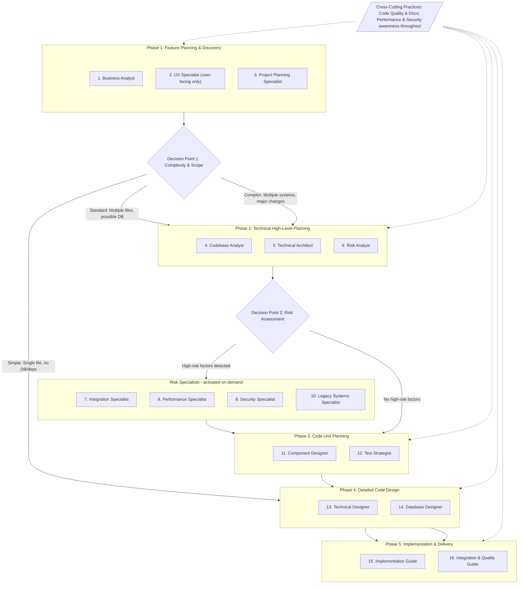

# Adaptive Feature Development: Workflow and Personas

```mermaid
flowchart TD
  classDef pad fill:transparent,stroke:transparent,color:transparent;
  %% Phase 1
  subgraph P1[Phase 1: Feature Planning & Discovery<br/>]
    direction TB
    subgraph P1Body[" "]
      direction TB
      P1_pad["<br/><br/>"]:::pad
      BA["1. Business Analyst"]
      UX["2. UX Specialist (user-facing only)"]
      PPS["3. Project Planning Specialist"]
    end
    style P1Body fill:transparent,stroke:transparent
  end

  DP1{"Decision Point 1: Complexity & Scope"}

  P1 --> DP1

  %% Phase 2
  subgraph P2[Phase 2: Technical High-Level Planning<br/>]
    direction TB
    P2_pad["<br/><br/>"]:::pad
    CA["4. Codebase Analyst"]
    TA["5. Technical Architect"]
    RA["6. Risk Analyst"]
  end

  DP2{"Decision Point 2: Risk Assessment"}

  %% Conditional Risk Specialists (activated on demand)
  subgraph RS[Risk Specialists - activated on demand<br/>]
    direction TB
    RS_pad["<br/><br/>"]:::pad
    INT["7. Integration Specialist"]
    PERF["8. Performance Specialist"]
    SEC["9. Security Specialist"]
    LEG["10. Legacy Systems Specialist"]
  end

  %% Phase 3
  subgraph P3[Phase 3: Code Unit Planning<br/>]
    direction TB
    P3_pad["<br/><br/>"]:::pad
    CD["11. Component Designer"]
    TS["12. Test Strategist"]
  end

  %% Phase 4
  subgraph P4[Phase 4: Detailed Code Design<br/>]
    direction TB
    P4_pad["<br/><br/>"]:::pad
    TD["13. Technical Designer"]
    DB["14. Database Designer"]
  end

  %% Phase 5
  subgraph P5[Phase 5: Implementation & Delivery<br/>]
    direction TB
    P5_pad["<br/><br/>"]:::pad
    IG["15. Implementation Guide"]
    IQ["16. Integration & Quality Guide"]
  end

  %% Decision Point 1 routing
  DP1 -->|Simple: Single file, no DB/deps| P4
  DP1 -->|Standard: Multiple files, possible DB| P2
  DP1 -->|Complex: Multiple systems, major changes| P2

  %% Decision Point 2 routing
  P2 --> DP2
  DP2 -->|High-risk factors detected| RS
  RS --> P3
  DP2 -->|No high-risk factors| P3

  %% Core sequence
  P3 --> P4 --> P5
  P4 --> P5

  %% Cross-cutting practices
  CC[/"Cross-Cutting Practices: Code Quality & Docs; Performance & Security awareness throughout"/]
  CC -.-> P1
  CC -.-> P2
  CC -.-> P3
  CC -.-> P4
  CC -.-> P5
```
